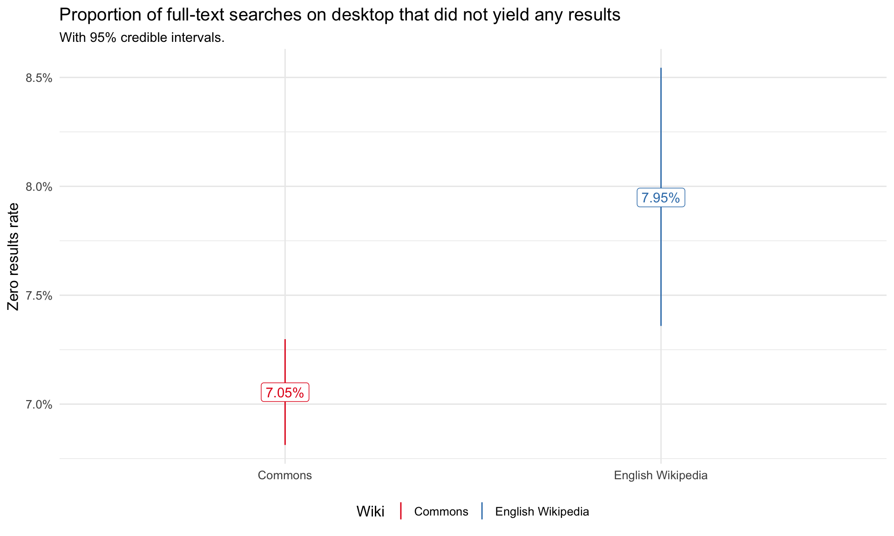
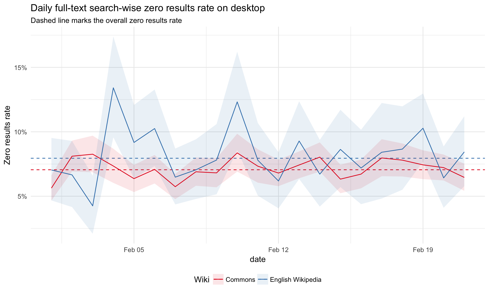
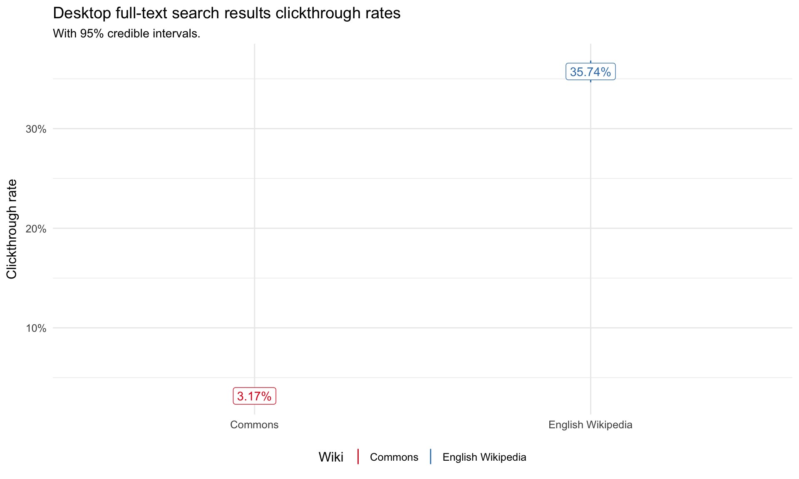
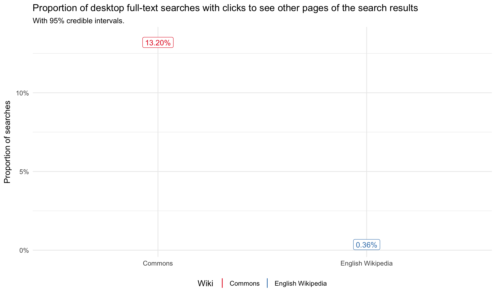
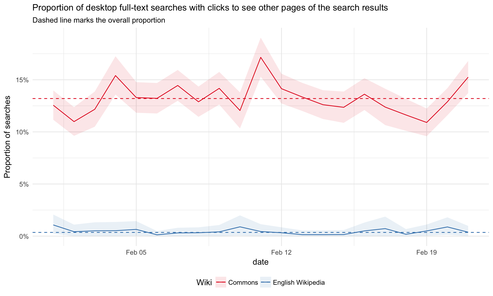
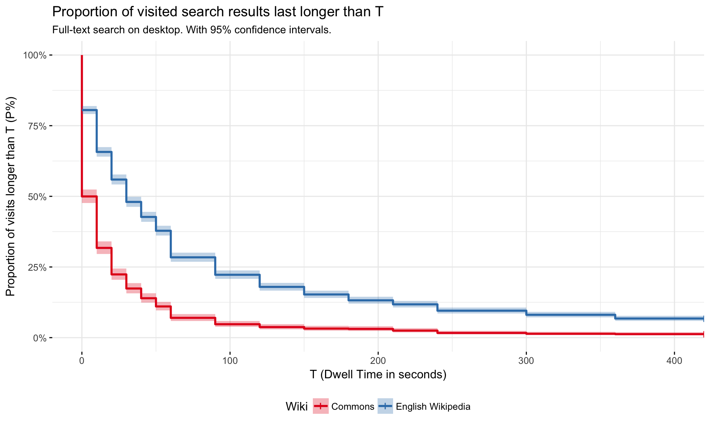
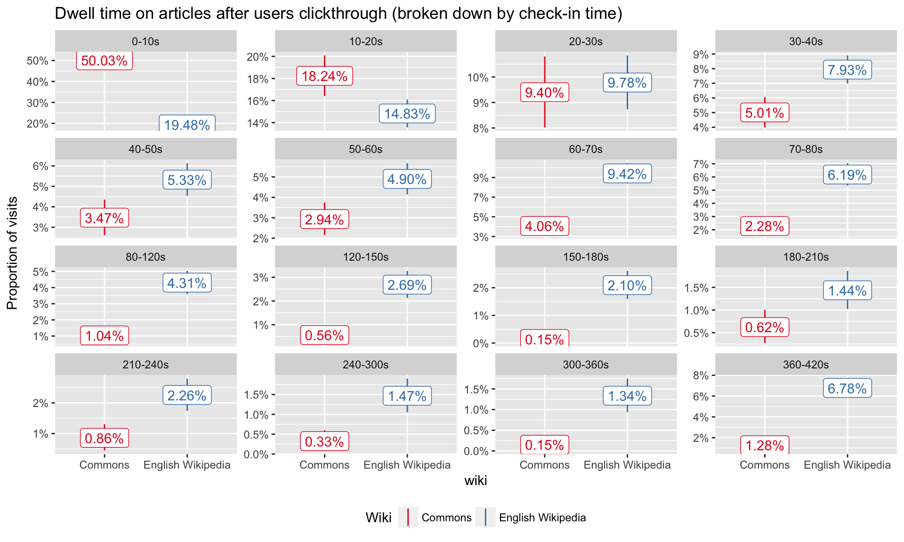
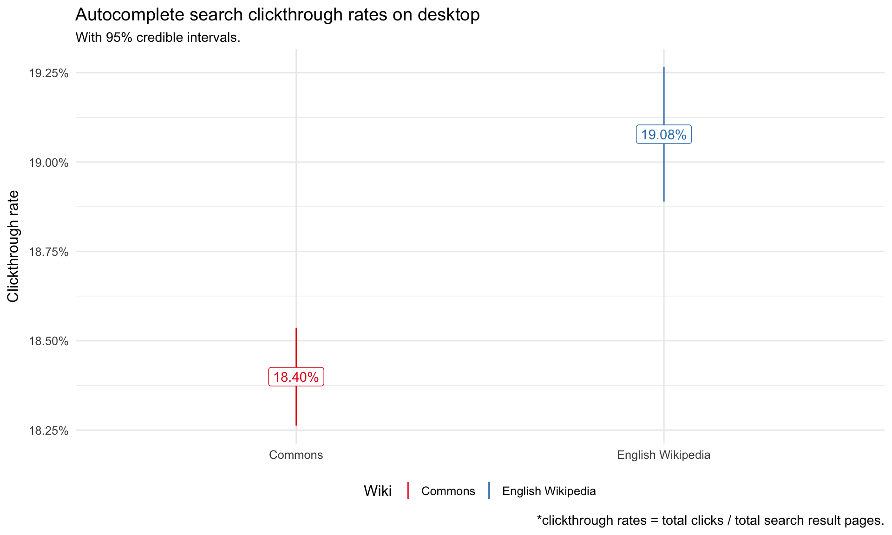
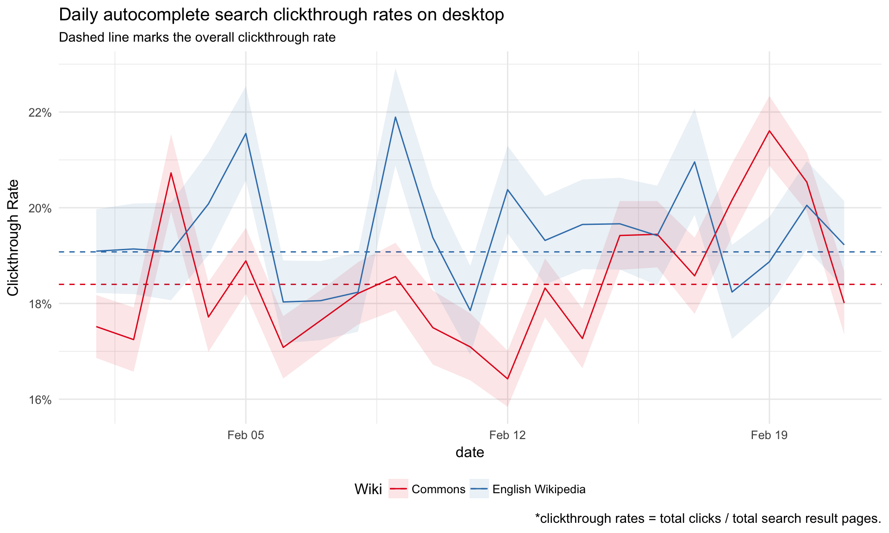

# Desktop search metrics on Wikimedia Commons compared to English Wikipedia (Redux)

Epic Ticket: [T185363](https://phabricator.wikimedia.org/T185363)

## Overview

This is a replicate of Chelsy's analysis from November 2017, [T177534](https://phabricator.wikimedia.org/T177534), computing desktop search metrics on Wikimedia Commons and comparing them to English Wikipedia to understand how well the search engine serve the users on Wikimedia Commons.  

I computed several search metrics with event logging data (TestSearchSatisfaction2 table) from February 2018. Metrics were compared to English Wikipedia desktop searches as there are less than 100 search results daily on mobile web on Commons. Results are similar to those found in November 2017 with some notable changes in rates. For example, there was a decline in the full-text search clickthrough rate on Commons from 10.42% in November 2017 to 3.17% in February 2018. 

## Objectives

1. Compare the desktop full-text search zero result rate on Commons vs English Wikipedia. Break down the number by day.
2. Compare the desktop full-text search clickthrough rate on Commons vs English Wikipedia. Break down the number by day.
3. Compare the proportion of desktop full-text searches with clicks to see other pages of the search results on Commons vs English Wikipedia. Break down the number by day.
4. Compare the dwell time on pages after users clickthrough on Commons vs English Wikipedia.
5. Compare the desktop autocomplete search clickthrough rate on Commons vs English Wikipedia. Break down the number by day.

Ticket: [T18675](https://phabricator.wikimedia.org/T187827)

## Desktop full-text search zero result rate (zrr) 

The average zero results rate (proportion of full-text desktop searches that did not yeild any results) is still only slightly lower on Commons (7.05%) compared to English Wikipedia (7.95%) in February 2018.  The zero results rate for both sites is slightly lower than the rates found for November 2017.

## Desktop full-text search clickthrough rate (ctr)

The full-text search clickthrough rate (proportion of seraches with at least one click on the search results) on Commons is much lower than English Wikipedia, only 3.17%. This is also a decline from the clickthrough rate found in November 2017 (10.42%). 

## Desktop full-text searches with clicks to see other pages 

As also found in November 2017, users on Commons are much more likely to click to see other pages of search results. 

## Dwell time on pages after users clickthrough

I also reviewed the users dwell time (the time the user has spent on a page) after users clickthrough past the search results page. Overall users on Commons spend a shorter time on pages after clickthrough compared to English Wikipedia. Visitors are more likely to leave the page within 10 seconds on Commons. 

However, this may not be indicative of how well the search engine is serving users and more indicative of they type of content found on the sites. Commons pages can usually be viewed in a quicker timespan than English Wikipedia pages.  

## Desktop autocomplete search clickthrough rate

Similar to full-text searches, Commons has lower rate of clickthrough for autocompleted searches compared to English Wikipedia on desktop; however, the difference is not as significant as it was for full-text searches. 

In February 2018, there was a higher clickthrough rate for autocomplete searches (18.40%) compared to full-text searches (3.17%) on Commons. There was a reverse trend for English Wikipedia searches, which had a lower clickthrough rate for autocomplete searches (19.08%) compared to full-text searches (35.74%). 

