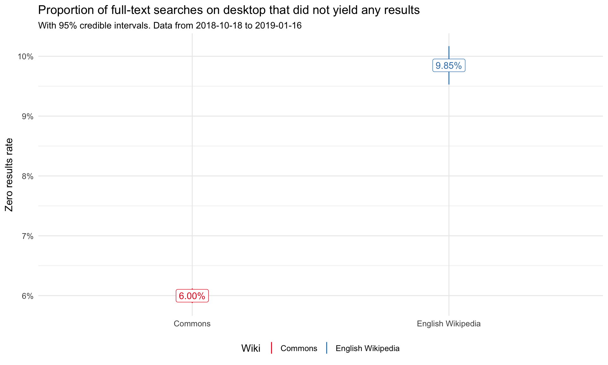
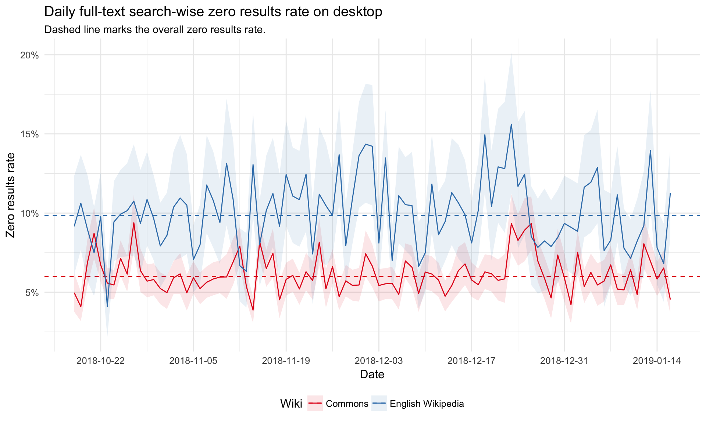
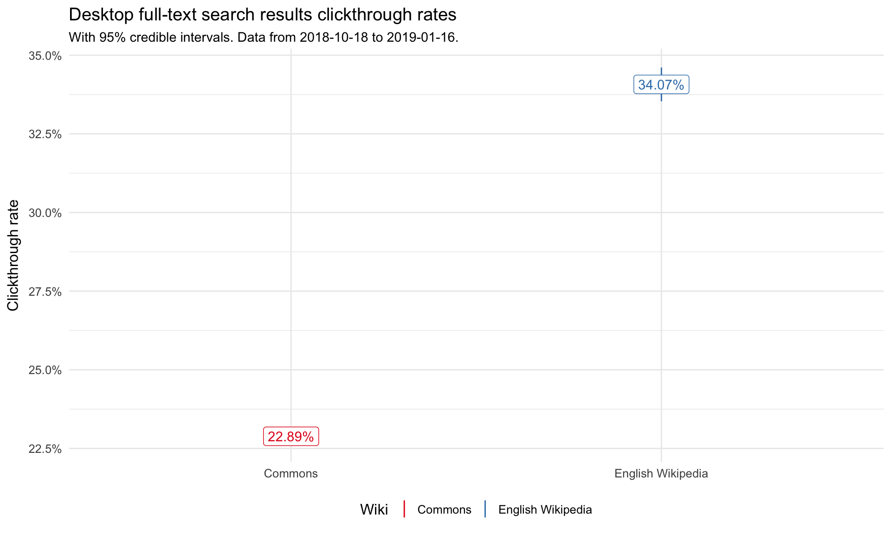
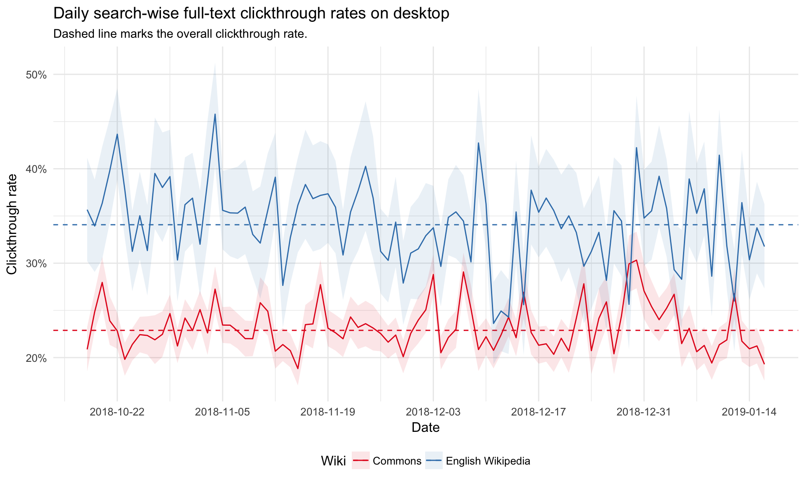
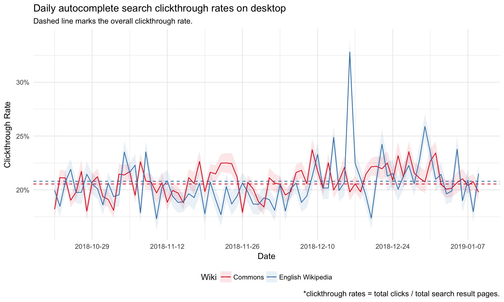
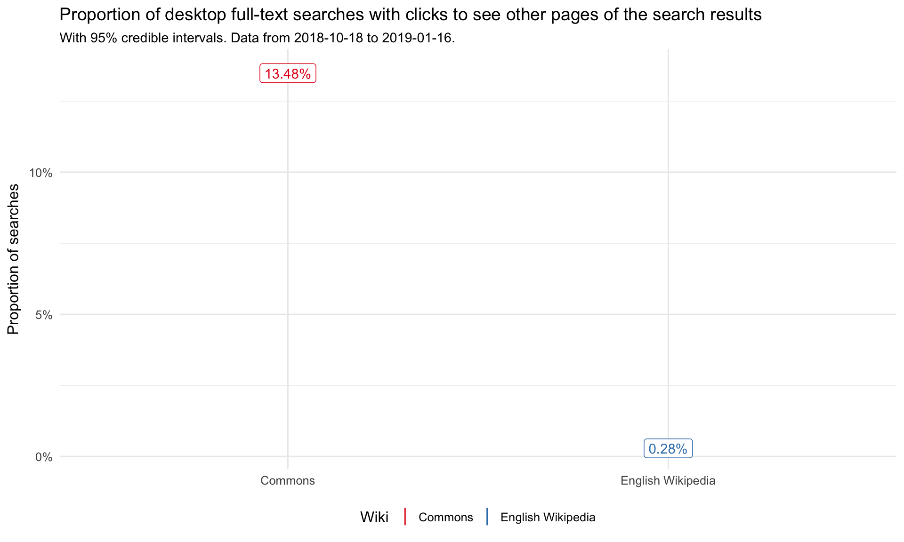
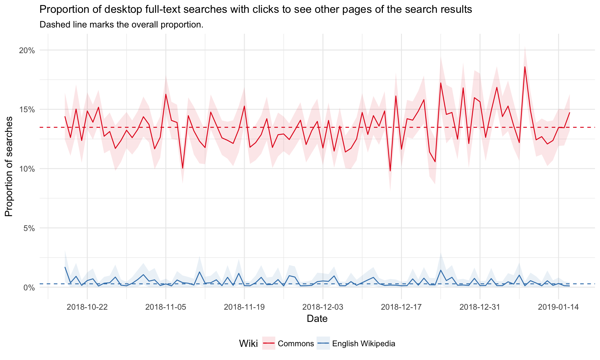
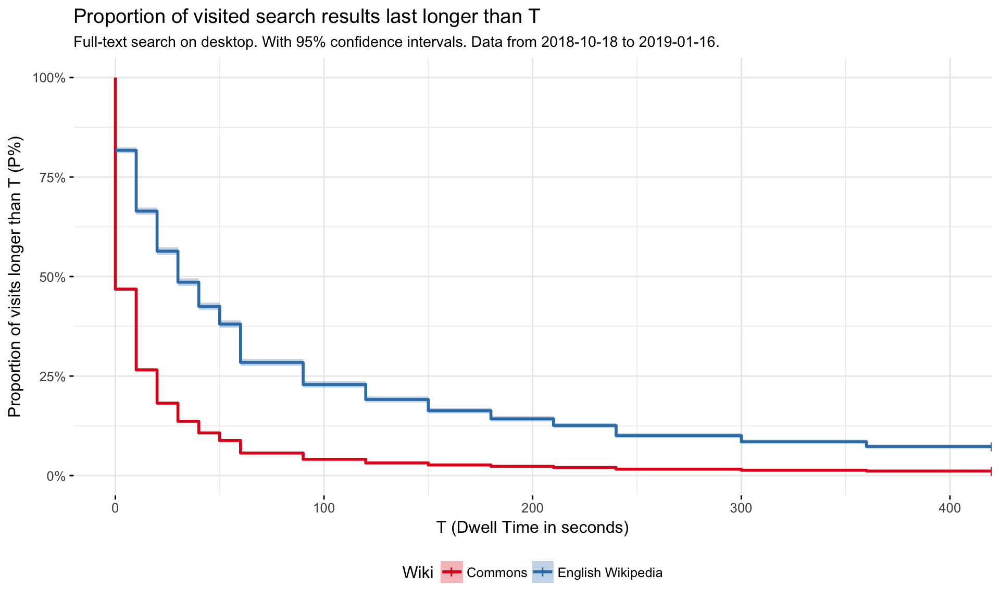
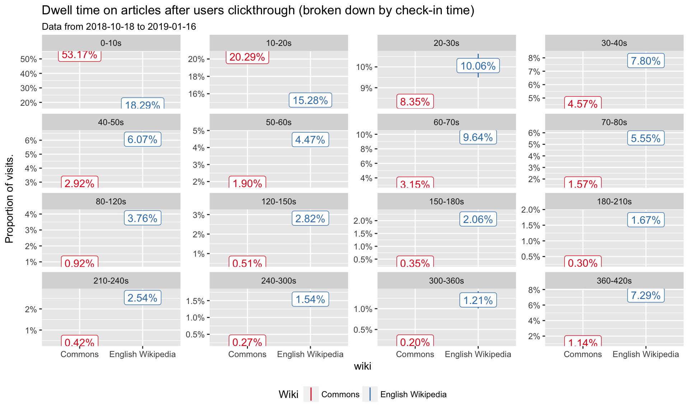

# Search metrics on Wikimedia Commons (October 2018-January 2019)

## Overview

In February 2018, we discovered a drop in the in full-text search-wise clickthrough rate from 10.42% in November 2017 to only 3.17% in February 2018. Further investigation [T18675](https://phabricator.wikimedia.org/T187827) revealed this was due to image clicks not being recorded in event logging data (TestSearchSatisfaction2 table). This error was fixed in September 2018 [T189242](https://phabricator.wikimedia.org/T189242).  We redid the analysis to see how search metrics on Wikimedia Commons changed following the bug fix.

We computed several desktop search metrics on Wikimedia Commons with event logging data (TestSearchSatisfaction2 table) from October 18, 2018 to January 16, 2016. Metrics were compared to English Wikipedia desktop searches. We only reviewed searches on desktop since there are very few searches on mobile web on Commons. Specifically, We computed:

* Zero results rate (zrr): Proportion of searches that did not yield any results. The lower the better.
* Clickthrough rate (ctr): Proportion of searches with at least one click on the search results. The higher the better.
* Proportion of searches with clicks to see other pages of the search results. The lower the better. 
* Dewll times on pages after users clickthrough.
* Desktop automcomplete search clickthrough on Commons. 

Results show an increase in the full-text search clickthrough rate on Commons from 3.17% in February 2018 (pre-bux fix) to 22.89% in data reviewed between October 2018 to January 2019 (post-bug fix). There was a slight decrease in the zero results rate from 7.05% to 6%. The proportion of searches with clicks to other search result pages stayed roughly the same with only a very slight increase from 13.2% to 13.48%.

## Comparison of February 2018 and January 2019 Search Metrics on Wikimedia Commons

| Search metric | February 2018 (pre-bux fix) | January 2019 (post-bug fix)|
| ------------- |:-------------:| -----:|
| ZRR     | 7.05%  |  6% |
| CTR     | 3.17%   | 22.89%   |
| Searches with clicks to see other serach result pages   |  13.20%   | 13.48%  |

## Desktop full-text search zero result rate (zrr) 

6.0% of full-text searches on desktop did not yield any results on Wikimedia Commons, which is lower than the 9.85% zero results rate found on English Wikipedia during the same time period. 

## Desktop full-text search clickthrough rate (ctr)

The full-text search clickthrough rate is 22.89% on Commons. This is a signficant increase from the clickthrough rates on Commons found in November 2017 (10.42%) and February 2018 (3.17%).

## Desktop full-text searches with clicks to see other pages 

As also found in February 2018, users on Commons are much more likely to click to see other pages of search results on Commons (13.48%) compared to English Wikipedia (0.28%). 

## Dwell time on pages after users clickthrough

I also reviewed the users dwell time (the time the user has spent on a page) after users clickthrough past the search results page. Overall users on Commons spend a shorter time on pages after clickthrough compared to English Wikipedia. Similar to results found in February 2018, visitors are more likely to leave the page within 10 seconds on Commons. 

However, this may not be indicative of how well the search engine is serving users and more indicative of they type of content found on the sites. Commons pages can usually be viewed in a quicker timespan than English Wikipedia pages.  

